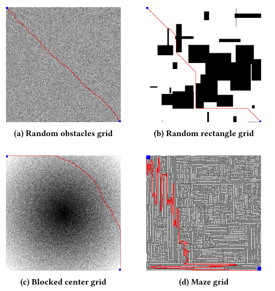
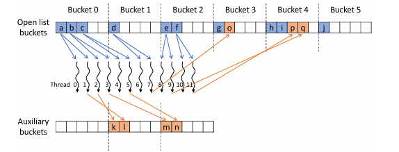
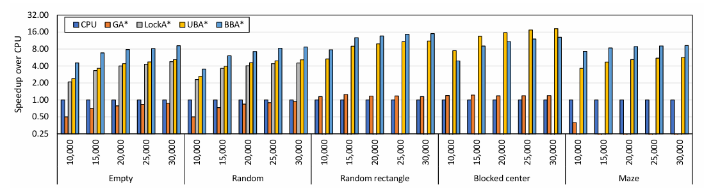

# Parallel Bidirectional A* Search for GPU-Accelerated Pathfinding

Implementation accompanying the paper **Parallel Bidirectional A* Search for GPU-Accelerated Pathfinding**. The repository contains CUDA implementations of both bidirectional and unidirectional bucket-based A* for grid pathfinding, plus a shell-based demo that runs a small experiment suite and summarizes the results.

## Paper

- Title: *Parallel Bidirectional A* Search for GPU-Accelerated Pathfinding*
- Authors: Hadi Al Khansa, Juan Gomez-Luna, Amer E. Mouawad, Izzat El Hajj
- DOI: <https://doi.org/10.1145/3797905.3805620>

## Repository Layout

- `src/`: CUDA implementations and executable entrypoints.
- `include/`: CUDA headers, shared constants, and implementation-specific types.
- `CPU/`: reference CPU baselines kept for comparison.
- `scripts/`: benchmark utilities and legacy exploratory helpers.
- `data/maps/`: bundled sample MovingAI map and scenario used by the demo.
- `data/generated/`: bundled compressed-grid sample for procedural/generated-grid testing.

## Requirements

- Windows with an NVIDIA GPU that supports cooperative kernel launch
- CUDA Toolkit with `nvcc` in `PATH`
- MSVC with `cl.exe` in `PATH`
- GNU Make-compatible `make`
- Git Bash or another Bash-compatible shell for `demo.sh`

The Makefile currently targets `sm_89` by default. If your GPU uses a different architecture, override it when building:

```powershell
make CUDA_ARCH=sm_86
```

## Build

From the repository root:

```powershell
make
```

This produces:

```text
bin/astar_bidirectional.exe
```

To build the unidirectional CUDA implementation:

```powershell
make unidirectional
```

This produces:

```text
bin/astar_unidirectional.exe
```

Other supported targets:

```powershell
make debug
make unidirectional_debug
make clean
make help
```

## Run The Demo

The recommended entrypoint is the top-level shell demo. It runs:

- one bundled MovingAI `.map` reference case
- multiple larger procedural grid cases across several grid types
- a summary table with runtime, expanded nodes, path cost, and aggregate statistics

1. Build the CUDA binary.

   ```powershell
   make
   ```

2. Run the demo.

   From Git Bash:

   ```bash
   ./demo.sh
   ```

   From PowerShell with Git Bash installed in the default location:

   ```powershell
   & "C:\Program Files\Git\bin\bash.exe" ./demo.sh
   ```

   To run the shell demo with the unidirectional implementation, start with a smaller procedural case set:

   ```bash
   ./demo.sh --binary bin/astar_unidirectional.exe --cases 64:rectangle,64:zigzag,128:rectangle
   ```

3. Optional: increase repetitions to stabilize the summary statistics.

   ```bash
   ./demo.sh --repeats 3
   ```

4. Optional: customize the procedural cases.

   ```bash
   ./demo.sh --cases 512:random,512:maze,1024:rectangle --repeats 2
   ```

On success the script prints:

- every command it ran
- a detailed per-run results table
- summary statistics grouped by grid type
- summary statistics grouped by grid size
- an overall summary across the whole experiment suite

The raw results are also saved as a TSV file under `benchmark_results/`. By default the script removes `data/AstarPath.png` after each run to keep the repository clean; use `--keep-image` if you want to inspect the last rendered path.

The default larger procedural suite is tuned for the bidirectional CUDA binary. The extracted unidirectional kernel is still useful for comparison, but in practice it is more reliable on smaller procedural cases.

## Direct CLI Usage

The executable also supports direct invocation.

Bundled sample map:

```powershell
bin\astar_bidirectional.exe --map data\maps\arena.map --start-x 19 --start-y 26 --goal-x 19 --goal-y 29
```

The unidirectional binary supports the same `.map` benchmark interface:

```powershell
bin\astar_unidirectional.exe --map data\maps\arena.map --start-x 19 --start-y 26 --goal-x 19 --goal-y 29 --no-image
```

Procedural grids:

```powershell
bin\astar_bidirectional.exe [size [obstacle_rate [grid_type [compressed_grid_path]]]]
bin\astar_unidirectional.exe [size [obstacle_rate [grid_type [compressed_grid_path]]]]
```

Supported `grid_type` values:

- `random`
- `maze`
- `blockCenter`
- `zigzag`
- `rectangle`

The paper evaluates several synthetic grid families beyond the bundled sample. The figure below summarizes the main obstacle patterns used throughout the experiments and the kinds of paths the implementation reconstructs on them.

<p align="center">
  
</p>

<p align="center"><em>Representative procedural grid families used in the paper: random obstacles, random rectangles, blocked-center fields, and maze-like layouts.</em></p>

Bundled generated-grid sample with the bidirectional binary:

```powershell
bin\astar_bidirectional.exe 64 20 rectangle data\generated\demo_rectangle_64.bin
```

The same bundled sample also works with the unidirectional binary:

```powershell
bin\astar_unidirectional.exe 64 20 rectangle data\generated\demo_rectangle_64.bin
```

Both binaries accept the same positional compressed-grid path, so you can compare them directly on the same generated sample.

## Key Data Structures and Algorithm

At the lowest level, both CUDA implementations operate on a linearized 2D occupancy grid. Cells use the shared `PASSABLE = 0` and `OBSTACLE = 1` convention, movement is 8-connected, and costs are encoded as scaled integers so straight and diagonal relaxations can be handled with atomic integer updates (`SCALE_FACTOR` and `DIAGONAL_COST`).

The bidirectional path keeps a `BiNode` record for every cell. Each `BiNode` stores forward and backward `g`, `h`, and `f` values, separate parent pointers, and open-list addresses so the kernel can distinguish valid bucket entries from stale ones. Cross-block coordination is handled by `BidirectionalState`, which tracks the current logical bucket windows for the forward and backward searches, whether either direction has finished, and the globally best meeting cost and meeting node discovered so far.

Instead of a serial heap, the bidirectional kernel organizes the frontier as two circular bucketed open lists, one per direction, plus per-direction expansion buffers. A typical iteration:

- initializes or updates the active forward and backward bucket ranges
- assigns GPU threads to node-neighbor expansions inside those bucket windows
- relaxes neighbors atomically on the shared node array
- checks for forward/backward meeting opportunities and updates the global best path cost
- copies newly improved nodes from the expansion buffers back into the bucketed open lists
- reconstructs the final route by stitching together the start-to-meeting and meeting-to-goal parent chains

The unidirectional path uses a simpler `Node` structure with `g`, `h`, `f`, and `parent`. Its frontier is still bucketed, but it also keeps a bitmask over non-empty buckets so the kernel can find the next active range quickly. Nodes whose new `f` values remain inside the current active bucket window are staged in shared memory first; nodes that fall outside that window are inserted directly into later buckets.

At a high level, the unidirectional kernel:

- selects the next active bucket range from the bitmask-backed frontier
- expands nodes in parallel across that range
- relaxes neighbors and routes them either to the shared staging window or to future buckets
- stops once the goal has been reached and reconstructs the parent chain back to the start

Both variants depend on cooperative groups and grid-wide synchronization. That synchronization lets bucket selection, parallel expansion, frontier copying, and stopping logic happen inside one coordinated GPU execution model rather than through a long sequence of host-driven priority-queue operations.

<p align="center">
  
</p>

<p align="center"><em>Bucketed frontier management is the core organizing idea: threads expand nodes from the current bucket window while newly improved nodes are staged in auxiliary buffers or inserted into later buckets.</em></p>

## Benchmarks

The repository intentionally ships only minimal bundled samples. To run larger `.map` experiments, place additional MovingAI `.map` and `.map.scen` files under `data/maps/` and use:

```powershell
python scripts\run_maps_benchmark.py --binary bin\astar_bidirectional.exe --maps-dir data\maps --limit-scenarios 10
```

To benchmark the unidirectional binary instead:

```powershell
python scripts\run_maps_benchmark.py --binary bin\astar_unidirectional.exe --maps-dir data\maps --limit-scenarios 10
```

The benchmark discussion in the paper emphasizes that the bucketed bidirectional GPU search becomes especially effective as the grids grow larger and the obstacle structure becomes more irregular. The figure below summarizes that reported trend at a glance.

<p align="center">
  
</p>

<p align="center"><em>Illustrative benchmark summary: the reported speedups grow with grid complexity, and BBA* delivers the strongest gains among the compared GPU baselines.</em></p>

Results are written to `benchmark_results/`.

## Notes

- The CUDA implementation relies on cooperative groups and grid-wide synchronization.
- The CPU sources are provided as reference baselines, but the primary supported workflows in this release are the two CUDA binaries above.
- `demo.sh` targets Bash. On Windows, Git Bash works well and can still launch the compiled `.exe` binaries directly.
